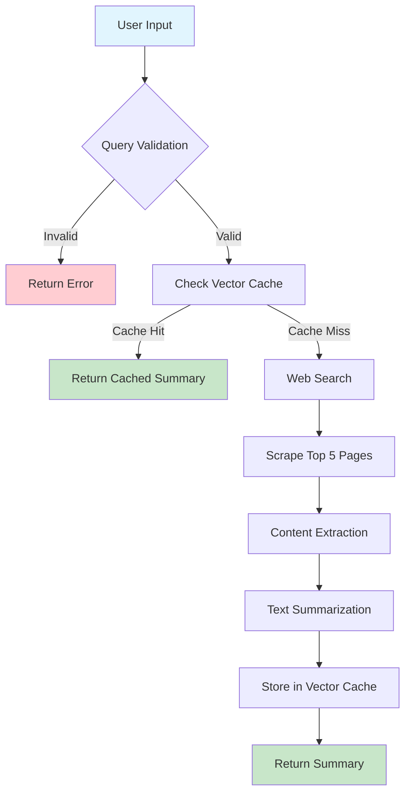
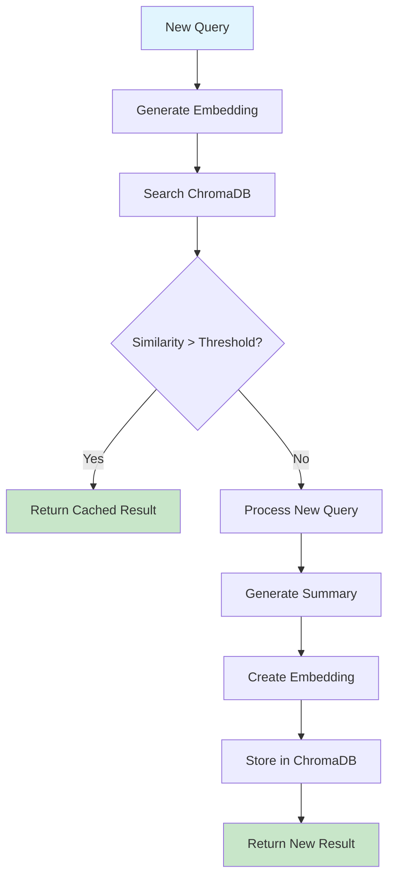

# Web Search Agent - Architecture Documentation

## 🎯 System Overview

A **multi-interface web search agent** that intelligently processes user queries, validates them using machine learning, searches the web, scrapes content, and provides AI-powered summaries with intelligent caching using vector databases.

## 🏗️ High-Level Architecture

```
┌─────────────────────────────────────────────────────────────────┐
│                    WEB SEARCH AGENT SYSTEM                     │
├─────────────────────────────────────────────────────────────────┤
│                                                                 │
│  ┌─────────────────┐              ┌─────────────────┐          │
│  │   Web Interface │              │ CLI Interface   │          │
│  │    (Flask)      │              │   (main.py)     │          │
│  └─────────────────┘              └─────────────────┘          │
│           │                                │                   │
│           └────────────────┬───────────────┘                   │
│                           │                                   │
│  ┌─────────────────────────────────────────────────────────────┤
│  │                  CORE PROCESSING PIPELINE                   │
│  │                                                             │
│  │  ┌─────────────┐  ┌─────────────┐  ┌─────────────┐        │
│  │  │   Query     │  │   Vector    │  │    Web      │        │
│  │  │ Classifier  │  │   Cache     │  │  Scraper    │        │
│  │  │ (ML Model)  │  │ (ChromaDB)  │  │             │        │
│  │  └─────────────┘  └─────────────┘  └─────────────┘        │
│  │                                                             │
│  │              ┌─────────────────────────────────────────────┤
│  │              │         TEXT SUMMARIZATION                  │
│  │              │        (Transformer Model)                  │
│  │              └─────────────────────────────────────────────┤
│  └─────────────────────────────────────────────────────────────┘
│                                                                 │
│  ┌─────────────────────────────────────────────────────────────┤
│  │                     DATA LAYER                              │
│  │                                                             │
│  │  ┌─────────────┐  ┌─────────────┐  ┌─────────────┐        │
│  │  │ ChromaDB    │  │ ML Models   │  │  Web APIs   │        │
│  │  │ (Vectors)   │  │ (Pickle)    │  │(DuckDuckGo) │        │
│  │  └─────────────┘  └─────────────┘  └─────────────┘        │
│  └─────────────────────────────────────────────────────────────┘
└─────────────────────────────────────────────────────────────────┘
```

## 🔧 Engineering Choices & Decisions

### 1. **Dual Interface Architecture**
**Choice**: Flask web interface + CLI interface
**Reasoning**: 
- Web interface for user-friendly interaction with real-time progress
- CLI for automation, scripting, and developer testing
- Both share the same core processing pipeline

### 2. **Vector Database Migration**
**Choice**: ChromaDB over Pickle-based cache
**Reasoning**:
- **Performance**: O(log n) vs O(n) search complexity
- **Scalability**: Handles millions of vectors efficiently
- **Reliability**: Robust database vs fragile pickle files
- **Memory**: Optimized storage vs loading everything in RAM

### 3. **ML-based Query Validation**
**Choice**: Sentence transformers + trained classifier
**Reasoning**:
- Prevents wasted API calls on invalid queries
- Semantic understanding rather than simple keyword matching
- Trained on domain-specific data for better accuracy

### 4. **Real-time Progress Updates**
**Choice**: Server-Sent Events (SSE) over WebSockets
**Reasoning**:
- Simpler implementation for one-way communication
- Better for progress updates and notifications
- Native browser support, no additional libraries needed

## 📊 Detailed System Flow

### **Main Processing Pipeline**



### **Vector Cache System Flow**



## 🔬 Component Deep Dive

### **1. Query Classification Agent**

```python
# Architecture Decision: ML-based validation
def classify_query(query: str) -> str:
    embedding = model.encode([query])      # Semantic representation
    prediction = clf.predict([embedding])  # ML classification
    return "valid" if prediction == 1 else "invalid"
```

**Engineering Choices**:
- **Sentence Transformers**: Better semantic understanding than TF-IDF
- **Pre-trained + Fine-tuned**: Leverage existing knowledge + domain adaptation
- **Embedding-based**: Captures semantic similarity, not just keywords

### **2. Vector Cache System**

```python
# Architecture Decision: ChromaDB with cosine similarity
class ChromaDBCache:
    def __init__(self):
        self.client = chromadb.PersistentClient(path="./chroma_db")
        self.collection = self.client.get_or_create_collection(
            name="query_cache",
            metadata={"hnsw:space": "cosine"}  # Cosine similarity
        )
```

**Engineering Choices**:
- **HNSW Algorithm**: Hierarchical Navigable Small World for fast ANN search
- **Cosine Similarity**: Better for text embeddings than Euclidean distance
- **Persistent Storage**: Data survives application restarts

### **3. Web Scraping Pipeline**

```python
# Architecture Decision: Parallel processing with rate limiting
def scrape_multiple_pages(urls):
    contents = []
    for url in urls[:5]:  # Limit to top 5 results
        content = scrape_page(url)
        if content:
            contents.append(content[:5000])  # Limit content size
        time.sleep(1)  # Rate limiting
    return contents
```

**Engineering Choices**:
- **Rate Limiting**: Prevent being blocked by websites
- **Content Limiting**: Control memory usage and processing time
- **Error Handling**: Graceful degradation when scraping fails

### **4. Real-time Progress System**

```python
# Architecture Decision: Server-Sent Events for progress updates
def generate_progress():
    yield f"data: {json.dumps({'stage': 'validating', 'progress': 5})}\n\n"
    yield f"data: {json.dumps({'stage': 'searching', 'progress': 25})}\n\n"
    yield f"data: {json.dumps({'stage': 'scraping', 'progress': 55})}\n\n"
    yield f"data: {json.dumps({'stage': 'summarizing', 'progress': 85})}\n\n"
```

**Engineering Choices**:
- **Progressive Updates**: User sees immediate feedback
- **Structured Data**: JSON format for easy parsing
- **Stage-based Progress**: Clear indication of current operation

## 🎯 Data Flow Architecture

### **Request Processing Flow**

```
┌─────────────────────────────────────────────────────────────────┐
│                      REQUEST PROCESSING                        │
├─────────────────────────────────────────────────────────────────┤
│                                                                 │
│  1. User Input                                                  │
│     │                                                           │
│     ▼                                                           │
│  2. Query Validation (ML Classifier)                           │
│     │                                                           │
│     ▼                                                           │
│  3. Vector Cache Lookup                                         │
│     │                                                           │
│     ▼                                                           │
│  4. Web Search (if cache miss)                                 │
│     │                                                           │
│     ▼                                                           │
│  5. Content Scraping                                            │
│     │                                                           │
│     ▼                                                           │
│  6. Text Summarization                                          │
│     │                                                           │
│     ▼                                                           │
│  7. Cache Storage                                               │
│     │                                                           │
│     ▼                                                           │
│  8. Response Generation                                         │
│                                                                 │
└─────────────────────────────────────────────────────────────────┘
```

### **Vector Similarity Search Flow**

```
┌─────────────────────────────────────────────────────────────────┐
│                   VECTOR SIMILARITY SEARCH                     │
├─────────────────────────────────────────────────────────────────┤
│                                                                 │
│  Query: "What is machine learning?"                             │
│     │                                                           │
│     ▼                                                           │
│  Embedding Generation                                           │
│  [0.1, 0.3, -0.2, 0.8, ...]                                   │
│     │                                                           │
│     ▼                                                           │
│  ChromaDB Search                                                │
│  ┌─────────────────────────────────────────────────────────────┤
│  │ Stored Embeddings:                                          │
│  │ • "ML basics" → [0.1, 0.3, -0.1, 0.7, ...] (sim: 0.89)   │
│  │ • "Python tutorial" → [0.5, -0.1, 0.3, 0.2, ...] (sim: 0.34) │
│  │ • "AI overview" → [0.2, 0.4, -0.3, 0.9, ...] (sim: 0.78)  │
│  └─────────────────────────────────────────────────────────────┤
│     │                                                           │
│     ▼                                                           │
│  Best Match: "ML basics" (similarity: 0.89 > threshold: 0.75)  │
│     │                                                           │
│     ▼                                                           │
│  Return Cached Summary                                          │
│                                                                 │
└─────────────────────────────────────────────────────────────────┘
```

## 📈 Performance Optimizations

### **1. Caching Strategy**
- **Vector-based similarity**: Finds related queries, not just exact matches
- **Threshold tuning**: 0.75 similarity threshold for optimal cache hit rate
- **Embedding reuse**: Same model for cache and classification

### **2. Memory Management**
- **Content limiting**: Max 5000 characters per scraped page
- **Lazy loading**: ChromaDB loads data on-demand
- **Garbage collection**: Automatic cleanup of temporary variables

### **3. Network Optimization**
- **Rate limiting**: 1-second delays between requests
- **Top-N results**: Process only top 5 search results
- **Timeout handling**: Prevent hanging on slow websites

## 🔄 System Integration Points

### **Component Interactions**

```
┌─────────────────┐    ┌─────────────────┐    ┌─────────────────┐
│   Flask App     │    │   CLI App       │    │  Cache Manager  │
│   (app.py)      │    │  (main.py)      │    │ (cache_mgr.py)  │
└─────────────────┘    └─────────────────┘    └─────────────────┘
         │                       │                       │
         └───────────────┬───────────────┬───────────────┘
                         │               │
                         ▼               ▼
                ┌─────────────────────────────────────────┐
                │         SHARED COMPONENTS                │
                │                                         │
                │  ┌─────────────┐  ┌─────────────┐      │
                │  │   Agent     │  │   Cache     │      │
                │  │ (agent.py)  │  │(cache_db.py)│      │
                │  └─────────────┘  └─────────────┘      │
                │                                         │
                │  ┌─────────────┐  ┌─────────────┐      │
                │  │ Web Search  │  │ Summarizer  │      │
                │  │(web_search) │  │(summarizer) │      │
                │  └─────────────┘  └─────────────┘      │
                └─────────────────────────────────────────┘
```

## 🛠️ Technology Stack Decisions

### **Backend Technologies**
- **Python**: Excellent ML/AI ecosystem
- **Flask**: Lightweight, flexible web framework
- **ChromaDB**: Purpose-built vector database
- **Sentence Transformers**: State-of-the-art text embeddings

### **ML/AI Components**
- **Scikit-learn**: Reliable classification models
- **Transformers**: Modern NLP capabilities
- **Vector Search**: Semantic similarity matching

### **Web Technologies**
- **Server-Sent Events**: Real-time updates
- **JSON API**: Structured data exchange
- **REST endpoints**: Standard web API design

## 🎯 Key Architectural Benefits

### **1. Scalability**
- Vector database handles millions of queries
- Stateless design enables horizontal scaling
- Modular components for independent scaling

### **2. Maintainability**
- Clear separation of concerns
- Shared components reduce code duplication
- Comprehensive error handling and logging

### **3. Performance**
- Intelligent caching reduces API calls
- Parallel processing where possible
- Optimized algorithms (HNSW, cosine similarity)

### **4. User Experience**
- Real-time progress updates
- Fast cache retrieval
- Multiple interface options

## 🔮 Future Extensibility

### **Planned Enhancements**
1. **Multi-model Support**: Different embeddings for different domains
2. **Advanced Filtering**: Metadata-based cache filtering
3. **Distributed Caching**: Redis integration for multi-instance deployments
4. **API Rate Limiting**: User-based quotas and throttling
5. **Analytics Dashboard**: Usage statistics and performance metrics

This architecture provides a solid foundation for a production-ready web search agent with intelligent caching and real-time user interaction capabilities.